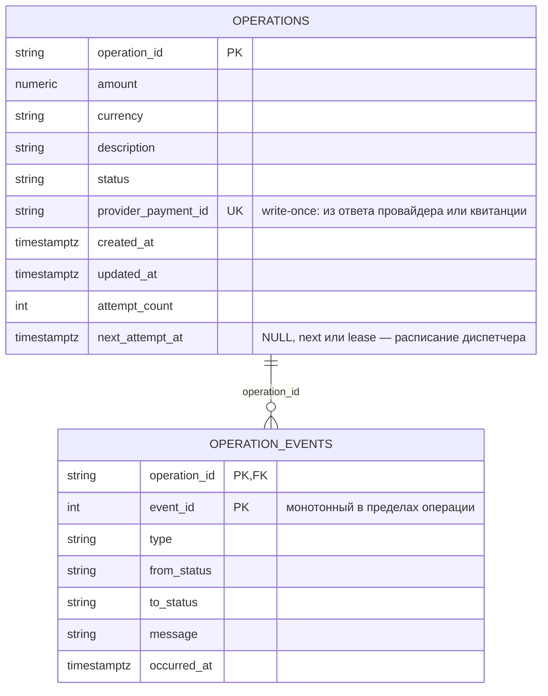

## PaProTesting (Payment Processing Testing)

Тестовое задание на стажировку в Модульбанк.

Сервис проводит платёжную операцию через внешнего провайдера и гарантирует:
не более одного платежа провайдера на операцию при любых повторах, конкурентных
запросах и перезапусках; финальный статус определяется только callback-квитанцией.
Сервис можно запускать в несколько инстансов без правок кода: воркеры
координируются через Postgres, а не через память процесса.

<!--Требования-->
## Требования

Docker и Docker Compose, все остальное собирается в контейнерах.

<!--Запуск-->
## Запуск

```bash
docker compose up --build
```

Поднимаются три сервиса:

| Сервис             | Адрес                  | Назначение                        |
|--------------------|------------------------|-----------------------------------|
| candidate-service  | http://localhost:8080  | сам сервис платёжных операций     |
| provider-simulator | http://localhost:8081  | симулятор внешнего провайдера     |
| db (PostgreSQL 17) | localhost:5434         | постоянное хранилище              |

Миграции применяются автоматически при старте контейнера. Проверка готовности:

```bash
curl http://localhost:8080/health
# {"status":"ok","database":"up"}
```

Повторный запуск с чистой базой:

```bash
docker compose down -v && docker compose up --build
```

<!--Сквозной сценарий-->
## Сквозной сценарий

Команды для bash. В PowerShell используйте `Invoke-RestMethod`.

```bash
# 1. Создать операцию — 201, status CREATED, providerPaymentId null
curl -i -X POST http://localhost:8080/operations \
  -H "Content-Type: application/json" \
  -d '{"operationId":"op-1","amount":"1000.00","currency":"RUB","description":"Оплата заказа"}'

# 2. Запланировать отправку — 202, status PROCESSING
curl -i -X POST http://localhost:8080/operations/op-1/submit

# 3. Повторный submit идемпотентен — 200, новое намерение не создаётся
curl -i -X POST http://localhost:8080/operations/op-1/submit

# 4. Подождать 2–3 секунды: воркер вызовет провайдера, провайдер пришлёт квитанцию

# 5. Финальное состояние — status COMPLETED, providerPaymentId заполнен
curl http://localhost:8080/operations/op-1

# 6. История переходов — CREATED -> SUBMITTED -> COMPLETED
curl http://localhost:8080/operations/op-1/events

# 7. Повторное создание того же operationId — 409 Conflict
curl -i -X POST http://localhost:8080/operations \
  -H "Content-Type: application/json" \
  -d '{"operationId":"op-1","amount":"1000.00","currency":"RUB"}'
```

<!--Схема данных-->
## Схема данных



`operation_events` использует композитный первичный ключ `(operation_id, event_id)` —
история переходов растёт только вставкой, ничего в ней не меняется задним числом.
Оба потока записи в `provider_payment_id` (ответ провайдера и квитанция) — условные
`UPDATE ... WHERE provider_payment_id IS NULL`, поэтому поле честно write-once.

<!--Как обеспечивается инвариант-->
## Как обеспечивается инвариант

- Намерение отправки — атомарный `UPDATE ... WHERE status = 'CREATED'` до
  сетевого вызова: из конкурентных `submit` намерение создаёт ровно один.
- Отправляет фоновый диспетчер: claim через `FOR UPDATE SKIP LOCKED` + lease;
  повторы — с тем же `Idempotency-Key` и неизменным телом, backoff с jitter.
- Сбой сети или 5xx не меняют статус — ложный отказ и второй платёж исключены.
- `providerPaymentId` записывается один раз: из ответа провайдера или из первой
  валидной квитанции; поздний 202 не отменяет финал.
- Финал ставит только обработчик квитанций, одной транзакцией: повторная
  квитанция — 204 без перехода, конфликтующая — 204 + `RECEIPT_IGNORED`,
  несовпадающий `providerPaymentId` — 409.
- После рестарта воркер сам подбирает незавершённые `PROCESSING`-операции.

<!--Метрики-->
## Метрики

`GET /metrics` — метрики Prometheus: количество операций по статусам
(`payment_operations`) и попытки отправки провайдеру по исходам
(`payment_dispatch_attempts_total`).

<!--Конфигурация-->
## Конфигурация

Все переменные окружения имеют значения по умолчанию, для запуска через
Docker Compose ничего настраивать не нужно.

| Переменная                    | По умолчанию          | Назначение                    |
|-------------------------------|-----------------------|-------------------------------|
| PROVIDER_URL                  | http://localhost:8081 | адрес провайдера              |
| POSTGRES_HOST / POSTGRES_PORT | localhost / 5434      | адрес БД (в compose: db/5432) |
| POSTGRES_USER / POSTGRES_PASSWORD / POSTGRES_DB | app / app / payments | доступ к БД |
| WORKER_POLL_INTERVAL          | 1.0                   | период опроса очереди, сек    |
| WORKER_BATCH_SIZE             | 10                    | размер пачки воркера          |
| WORKER_LEASE_SECONDS          | 30                    | lease на обработку операции   |
| WORKER_BACKOFF_BASE / WORKER_BACKOFF_CAP | 0.5 / 15.0 | параметры backoff, сек       |

<!--Разработка-->
## Разработка

Запуск кода на хосте против инфраструктуры в контейнерах:

```bash
poetry install
docker compose up -d db provider-simulator
poetry run alembic upgrade head
poetry run uvicorn app.main:app --port 8080
```

Линтер и тесты (тестам нужен запущенный контейнер `db` — тестовая база
`payments_test` создаётся автоматически):

```bash
poetry run ruff check app tests
poetry run pytest
```

<!--описание коммитов-->
## Описание коммитов

| Тип      | Описание                                            |
|----------|-----------------------------------------------------|
| feat     | Новая функциональность                              |
| fix      | Исправление ошибок                                  |
| chore    | Инфраструктура: сборка, зависимости, конфигурация   |
| docs     | Документация                                        |
| test     | Тесты                                               |
| refactor | Правки кода без изменения поведения                 |

<!--от себя-->
## От себя

Мультиинстансность не требовалась заданием напрямую, но те же механизмы —
атомарные переходы, claim с локом, write-once `providerPaymentId` — нужны
и одному инстансу, чтобы пережить конкурентные запросы и рестарты;
масштабирование из них получается бесплатно. Делал задание в том числе
как возможность поучиться новому.
